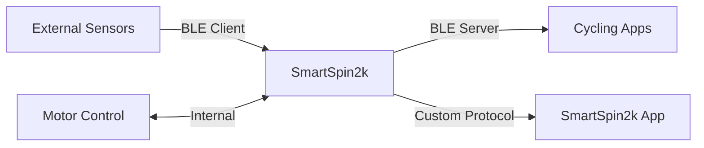

## Overview

SmartSpin2k implements multiple Bluetooth Low Energy (BLE) services to provide comprehensive fitness tracking and control capabilities. The device acts as both a BLE server (advertising fitness data) and a BLE client (connecting to external sensors).

## BLE Services Architecture

SmartSpin2k exposes the following standard and custom BLE services:

### Standard Fitness Services

<CardGroup cols={2}>
  <Card title="Fitness Machine Service" icon="dumbbell" href="/api/ftms-service">
    GATT Service UUID: `0x1826`
    
    Implements the FTMS standard for indoor bike simulation, ERG mode, and resistance control.
  </Card>
  
  <Card title="Cycling Power Service" icon="bolt" href="/api/cycling-power-service">
    GATT Service UUID: `0x1818`
    
    Broadcasts power measurements with crank and wheel revolution data.
  </Card>
  
  <Card title="Cycling Speed & Cadence" icon="gauge" href="/api/csc-service">
    GATT Service UUID: `0x1816`
    
    Provides speed and cadence measurements for cycling apps.
  </Card>
  
  <Card title="Heart Rate Service" icon="heart-pulse">
    GATT Service UUID: `0x180D`
    
    Relays heart rate data from connected monitors.
  </Card>
</CardGroup>

### Custom Services

<Card title="SmartSpin2k Custom Characteristic" icon="gear" href="/api/custom-characteristic">
  Service UUID: `77776277-7877-7774-4466-896665500000`
  
  Characteristic UUID: `77776277-7877-7774-4466-896665500001`
  
  Proprietary protocol for reading and writing device configuration parameters.
</Card>

### Device Information Service

GATT Service UUID: `0x180A`

Provides device metadata:
- Manufacturer Name (`0x2A29`)
- Model Number (`0x2A24`)
- Serial Number (`0x2A25`)
- Hardware Revision (`0x2A27`)
- Firmware Revision (`0x2A26`)
- Software Revision (`0x2A28`)

## BLE Client Capabilities

SmartSpin2k can connect to external BLE devices as a client:

- **Power Meters**: Cycling Power Service (`0x1818`)
- **Heart Rate Monitors**: Heart Rate Service (`0x180D`)
- **Speed/Cadence Sensors**: CSC Service (`0x1816`)
- **Other Trainers**: Fitness Machine Service (`0x1826`)

## Connection Parameters

The device uses the following BLE connection parameters for optimal performance:

<ParamField path="minInterval" type="uint16_t" default="24">
  Minimum connection interval in 1.25ms units (30ms)
</ParamField>

<ParamField path="maxInterval" type="uint16_t" default="48">
  Maximum connection interval in 1.25ms units (60ms)
</ParamField>

<ParamField path="latency" type="uint16_t" default="0">
  Number of packets allowed to skip
</ParamField>

<ParamField path="timeout" type="uint16_t" default="200">
  Timeout in 10ms units before disconnecting (2000ms)
</ParamField>

## Data Flow

SmartSpin2k receives data from external sensors (power meters, heart rate monitors), processes it internally for motor control, and broadcasts the data to connected cycling apps via standard BLE services.

## Service Discovery

The device supports mDNS service advertisement with the following BLE service UUIDs:

- `0x1826` - Fitness Machine Service
- `0x1818` - Cycling Power Service  
- `0x1816` - Cycling Speed and Cadence Service
- `77776277-7877-7774-4466-896665500000` - SmartSpin2k Custom Service

## Implementation Notes

- Based on **NimBLE** stack for ESP32
- Supports multiple simultaneous client connections
- MTU negotiation up to 515 bytes for custom characteristic
- DirCon protocol support for TCP-based characteristic notifications
- All characteristics use little-endian byte order per BLE specification

## Next Steps

<CardGroup cols={2}>
  <Card title="FTMS Implementation" icon="bicycle" href="/api/ftms-service">
    Learn about indoor bike simulation and ERG mode
  </Card>
  
  <Card title="Custom Protocol" icon="code" href="/api/custom-characteristic">
    Read and write device configuration via BLE
  </Card>
  
  <Card title="Power Service" icon="bolt" href="/api/cycling-power-service">
    Understand power measurement broadcasting
  </Card>
  
  <Card title="CSC Service" icon="gauge" href="/api/csc-service">
    Speed and cadence data format
  </Card>
</CardGroup>