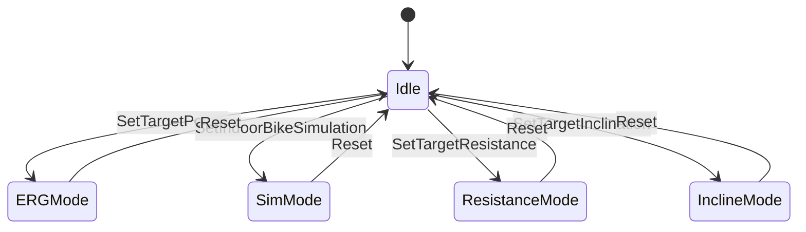

## Overview

SmartSpin2k implements the Fitness Machine Service (FTMS) specification, enabling compatibility with popular cycling apps like Zwift, TrainerRoad, and Rouvy. The implementation supports ERG mode, simulation mode, resistance control, and incline control.

## Service UUID

<ParamField path="Service UUID" type="UUID">
  `0x1826` (Fitness Machine Service)
</ParamField>

## Characteristics

### Fitness Machine Feature

<ParamField path="UUID" type="UUID">
  `0x2ACC`
</ParamField>

<ParamField path="Properties" type="flags">
  READ
</ParamField>

Describes the capabilities of the fitness machine.

**Feature Flags (8 bytes):**

```cpp
Bytes 0-3: Fitness Machine Features
  Bit 1:  Cadence Supported
  Bit 3:  Inclination Supported
  Bit 7:  Resistance Level Supported
  Bit 10: Heart Rate Measurement Supported
  Bit 14: Power Measurement Supported

Bytes 4-7: Target Setting Features
  Bit 1:  Inclination Target Setting Supported
  Bit 2:  Resistance Target Setting Supported
  Bit 3:  Power Target Setting Supported
  Bit 13: Indoor Bike Simulation Parameters Supported
  Bit 15: Spin Down Control Supported
  Bit 16: Targeted Cadence Configuration Supported
```

### Indoor Bike Data

<ParamField path="UUID" type="UUID">
  `0x2AD2`
</ParamField>

<ParamField path="Properties" type="flags">
  NOTIFY
</ParamField>

Broadcasts current cycling metrics in real-time.

**Data Format:**

```
Byte 0-1: Flags (uint16, little-endian)
  Bit 2: Instantaneous Cadence Present
  Bit 5: Resistance Level Present
  Bit 6: Instantaneous Power Present
  Bit 9: Heart Rate Present (if HRM connected)

Byte 2-3: Instantaneous Speed (uint16)
  Unit: 0.01 km/h
  Example: 2630 = 26.30 km/h

Byte 4-5: Instantaneous Cadence (uint16)
  Unit: 0.5 RPM
  Example: 180 = 90.0 RPM

Byte 6-7: Resistance Level (uint16)
  Unit: unitless (0-100)
  Calculated from stepper position if bike doesn't report resistance

Byte 8-9: Instantaneous Power (sint16)
  Unit: watts
  Example: 200 = 200W

Byte 10: Heart Rate (uint8, optional)
  Unit: BPM
  Only present if heart rate monitor connected
```

### Control Point

<ParamField path="UUID" type="UUID">
  `0x2AD9`
</ParamField>

<ParamField path="Properties" type="flags">
  WRITE | NOTIFY
</ParamField>

Receives commands from cycling apps to control the trainer.

**Supported Op Codes:**

#### Request Control (0x00)

```
Client writes: [0x00]
Server responds: [0x80, 0x00, 0x01]
  0x80 = Response Code
  0x00 = Request Control
  0x01 = Success
```

Must be called before other control operations.

#### Reset (0x01)

```
Client writes: [0x01]
Server responds: [0x80, 0x01, 0x01]
```

Resets the trainer to idle state.

#### Set Target Inclination (0x03)

```
Client writes: [0x03, LSB, MSB]
  Value: sint16, unit: 0.1%
  Range: -20.0% to +20.0%
  Example: 5.5% = 55 = [0x03, 0x37, 0x00]

Server responds: [0x80, 0x03, 0x01]
```

Sets the target incline for simulation mode.

#### Set Target Resistance Level (0x04)

```
Client writes: [0x04, LSB, MSB]
  Value: uint16, unitless
  Range: 0.1 to 100
  Example: Level 50 = [0x04, 0x32, 0x00]

Server responds: [0x80, 0x04, 0x01]
```

Sets resistance level directly (0-100 scale).

**Resistance Calculation:**
- For bikes with native resistance reporting: uses reported value
- For bikes without: calculates from stepper position
  ```cpp
  resistance = ((currentPosition - minPos) * 100) / (maxPos - minPos)
  ```

#### Set Target Power (0x05) - ERG Mode

```
Client writes: [0x05, LSB, MSB]
  Value: uint16, unit: watts
  Range: 1 to 4000W
  Example: 200W = [0x05, 0xC8, 0x00]

Server responds: [0x80, 0x05, 0x01] (success)
              or [0x80, 0x05, 0x02] (not supported - no power meter)
```

Enables ERG mode where trainer maintains constant power output.

<Note>
  ERG mode requires a connected power meter or power simulation enabled. The target is adjusted by `powerCorrectionFactor` before being sent to connected FTMS trainers.
</Note>

#### Start/Resume (0x07)

```
Client writes: [0x07]
Server responds: [0x80, 0x07, 0x01]
```

Starts or resumes training session.

#### Stop/Pause (0x08)

```
Client writes: [0x08, 0x01] (stop) or [0x08, 0x02] (pause)
Server responds: [0x80, 0x08, 0x01]
```

Stops or pauses the current training session.

#### Set Indoor Bike Simulation Parameters (0x11)

```
Client writes: [0x11, W_LSB, W_MSB, G_LSB, G_MSB, RR, WR]
  Wind Speed (W): sint16, unit: 0.001 m/s
  Grade (G): sint16, unit: 0.01%
  Rolling Resistance (RR): uint8, unit: 0.0001
  Wind Resistance (WR): uint8, unit: 0.01 kg/m

Server responds: [0x80, 0x11, 0x01]
```

Full simulation mode - SmartSpin2k uses the grade parameter for incline control.

#### Spin Down Control (0x13)

```
Client writes: [0x13]
Server responds: [0x80, 0x13, 0x01, 0x20, 0x03, 0x60, 0x09]
  0x80 = Response Code
  0x13 = Spin Down Control
  0x01 = Success
  0x20, 0x03 = Target Speed Low (8.00 km/h)
  0x60, 0x09 = Target Speed High (24.00 km/h)
```

Initiates spin down calibration procedure.

#### Set Targeted Cadence (0x14)

```
Client writes: [0x14, LSB, MSB]
  Value: uint16, unit: 0.5 RPM
  Example: 90 RPM = 180 = [0x14, 0xB4, 0x00]

Server responds: [0x80, 0x14, 0x01]
```

Sets target cadence (informational only).

### Fitness Machine Status

<ParamField path="UUID" type="UUID">
  `0x2ADA`
</ParamField>

<ParamField path="Properties" type="flags">
  NOTIFY
</ParamField>

Notifies status changes in response to control point commands.

**Status Codes:**

```cpp
0x01: Reset
0x02: Stopped or Paused by User
0x04: Started or Resumed by User
0x06: Target Incline Changed
0x07: Target Resistance Level Changed
0x08: Target Power Changed
0x12: Indoor Bike Simulation Parameters Changed
0x14: Spin Down Status
0x15: Targeted Cadence Changed
```

### Training Status

<ParamField path="UUID" type="UUID">
  `0x2AD3`
</ParamField>

<ParamField path="Properties" type="flags">
  READ | NOTIFY
</ParamField>

**Format:**
```
Byte 0: Flags (0x00)
Byte 1: Training Status
  0x00: Other
  0x01: Idle
  0x02: Warming Up
  0x0C: Watt Control (ERG Mode)
  0x0D: Manual Mode
```

### Resistance Level Range

<ParamField path="UUID" type="UUID">
  `0x2AD6`
</ParamField>

<ParamField path="Properties" type="flags">
  READ
</ParamField>

**Value:**
```
[0x01, 0x00, 0x64, 0x00, 0x01, 0x00]
  Min: 1 (0.1 resolution)
  Max: 100
  Increment: 1 (0.1 resolution)
```

### Power Range

<ParamField path="UUID" type="UUID">
  `0x2AD8`
</ParamField>

<ParamField path="Properties" type="flags">
  READ
</ParamField>

**Value:**
```
[0x01, 0x00, 0xA0, 0x0F, 0x01, 0x00]
  Min: 1W
  Max: 4000W
  Increment: 1W
```

### Inclination Range

<ParamField path="UUID" type="UUID">
  `0x2AD5`
</ParamField>

<ParamField path="Properties" type="flags">
  READ
</ParamField>

**Value:**
```
[0x38, 0xFF, 0xC8, 0x00, 0x01, 0x00]
  Min: -20.0% (0xFFF38 = -200 in 0.1% units)
  Max: 20.0% (0x00C8 = 200 in 0.1% units)
  Increment: 0.1%
```

## Control Mode State Machine

SmartSpin2k tracks the current control mode via `rtConfig->getFTMSMode()`:



## Speed Calculation

Speed is calculated based on wheel revolution data or simulated:

```cpp
if (rtConfig->getSimulatedSpeed() > 5) {
  speedFtmsUnit = rtConfig->getSimulatedSpeed() * 100;
} else {
  speedFtmsUnit = spinBLEServer.calculateSpeed() * 100;
}
```

## Resistance Calculation

For bikes that don't natively report resistance:

```cpp
int calculateResistanceFromPosition() {
  int32_t currentPosition = ss2k->getCurrentPosition();
  int32_t minPos = userConfig->getHMin();
  int32_t maxPos = userConfig->getHMax();
  
  int resistance = ((currentPosition - minPos) * 100) / (maxPos - minPos);
  return clamp(resistance, 0, 100);
}
```

## ERG Mode Power Correction

When in ERG mode, target power is adjusted before forwarding to connected trainers:

```cpp
int adjustedTarget = rtConfig->watts.getTarget() / userConfig->getPowerCorrectionFactor();
```

This allows calibration if the connected power meter reads differently than the bike's native resistance.

## Implementation Notes

- All multi-byte values use **little-endian** byte order
- Characteristics are updated at the main loop update rate
- Indoor Bike Data is notified on every update cycle when subscribed
- Control Point responses use notify (not indicate) for fast acknowledgment
- DirCon protocol mirrors all notifications over TCP for remote clients

## Reference

- [FTMS Specification v1.0](https://www.bluetooth.com/specifications/specs/fitness-machine-service-1-0/)
- Source: `BLE_Fitness_Machine_Service.cpp`
- Definitions: `BLE_Definitions.h`